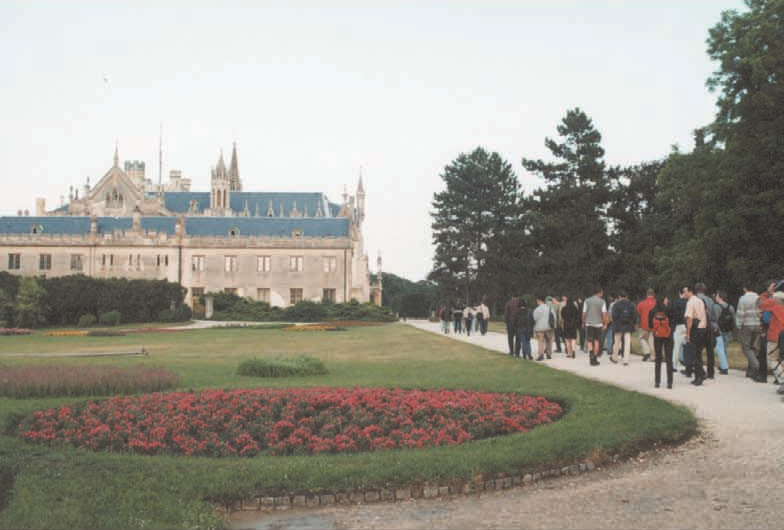
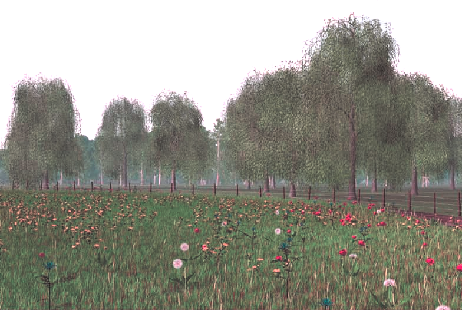

# Color transfer between images

In this project, I am implementing color transfer in lαβ, RGB and CIECAM97s color spaces. The goal here is to develop a system that can transfer the color characteristics from one image to another based on the paper "Color transfer between images. Erik Reinhard, Michael Ashikhmin, Bruce Gooch, and Peter Shirley.
IEEE Computer Graphics and Applications.21(5), 2001: 34 - 41."

This system can be used to correct/change the color in an image by choosing an appropriate target image and transferring its color characteristics to the source image.  

Please note that no ready to use OpenCV function is used except for loading and displaying the images. 

## Overview
 

  

       
 

  

       
 

   

       
 

