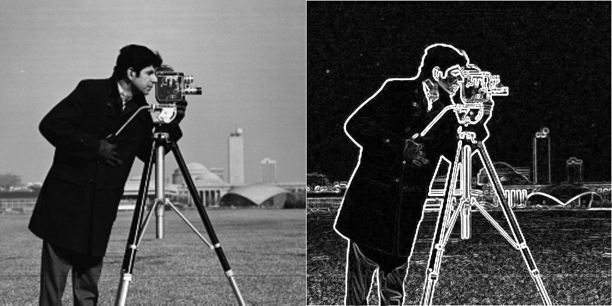

# Convolution

In this simple project, convolution function is implemented. Gaussian, derivative of Gaussian, and Sobel filters are implemented and tested on some images.

Please note that no OpenCV function is used except for loading and displaying the images. 

## Overview
 

       
      

