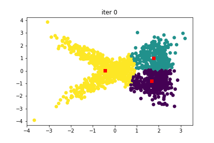
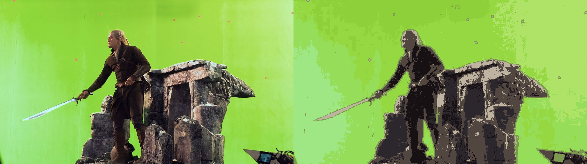

# Gaussian mixture model (GMM) Clustering

In this project, I implemented GMM algorithm from scratch. Then, I performed image segmentation on some test images with different k values.

Please note that no ready to use OpenCV function is used except for loading and displaying the images. 

## Overview
 

       
       
      

