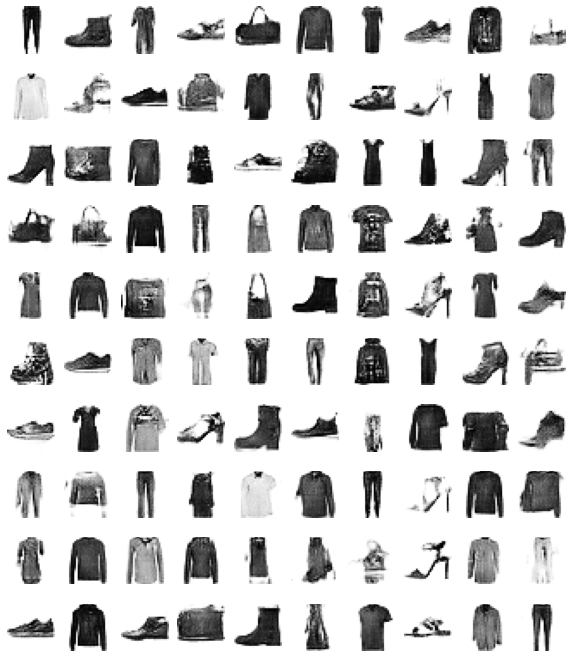

# Generative adversarial networks (GAN)

In this project, I implemented two GAN models, one with only dense layers and another with convolutional layers. My dense model's discriminator is composed of Dense and Dropout layers, while the generator is composed of BatchNormalization, Dense and Dropout layers. My CNN GAN's discriminator model is composed of Conv2D and Dropout layers, and the generator is composed of Conv2DTranspose layers. The models are tested on Fashin MNIST data. The GAN loss and discriminator loss on fake and real images are reported for every epoch and visualized every 10 epochs.

## Overview
 

       
      

