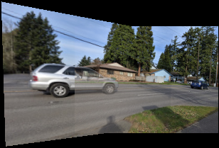

# Homography-based Image stitching

In this project, I am developing a software tool to stitch multiple images into a panorama. The list below are the required steps:

1. Given two input images, detect SIFT features from them using OpenCV.

2. Establish the feature correspondence between SIFT features in the two input images. Implement the feature matching algorithms.

3. Implement the RANSAC algorithm to find a robust homography between two input images using the feature correspondence.

4. Warp one of the input image using the estimated homography so that it aligns with the other input image.  Implement inverse warping algorithm with bilinear interpolation

Please note that no ready to use OpenCV function is used except for SIFT feature detection, loading and displaying the images. 

## Overview
  

       
       
       
 

