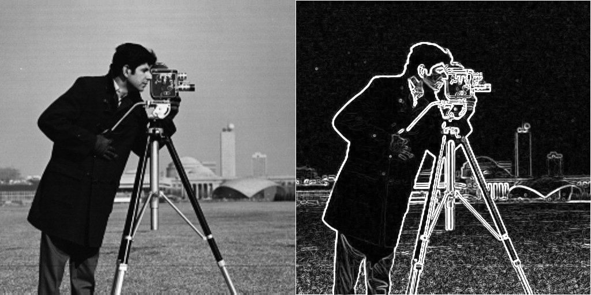
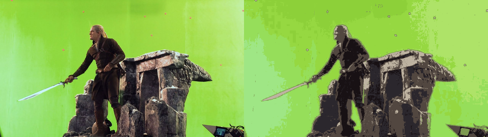
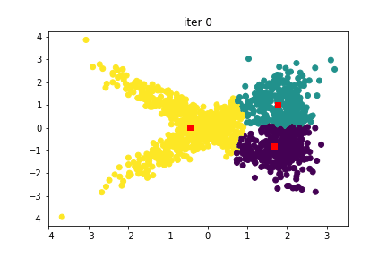

# Computer-vision-projects

In this repository I am sharing my **codes** for some projects and assignments of **the graduate level courses (Intro to computer vision, deep learning and computer vision)** I took during my PhD.

I hope you find it useful! :-)

You can use the link in each project to directly open and run the codes in google colab. Note that you should upload the files provided in the data path of each project. 

## Overview

### Projects

<table style="width:100%">
  <tr>
    <th>
      

           
            1: Convolution
            <a href="./Convolution" name="convolution_code">(code)</a>
      

    </th>
        <th>

           
            2: Image segmentation with k-means
            <a href="./Image%20segmentation%20with%20k-means/" name="kmeans_code">(code)</a>
        

    </th>
      </th>
        <th>

           
            
             3: Gaussian mixture model (GMM) Clustering
            <a href="./GMM/" name="GMM_code">(code)</a>
        

    </th>
  </tr>
  <tr>
    <th>
      

           
            4: Transfer learning
            <a href="./Transfer%20learning" name="transfer_code">(code)</a>
      

    </th>    
  <th>
      

           
            5: Grad-CAM saliency maps
            <a href="./Grad-CAM%20saliency%20maps" name="gradcam_code">(code)</a>
      

    </th>    
    <th>
      

           
            6: Generative adversarial networks (GAN)
            <a href="./Generative%20adversarial%20networks" name="gan_code">(code)</a>
      

    </th>    
  </tr>
   <tr>
  <th>
      

           
           
           
      

            7: Color transfer between images
            <a href="./Color%20transfer%20between%20images" name="colorTransfer_code">(code)</a>
      

    </th>  
      <th>
      

           
           
           
      

            8: Homography-based Image Stitching
            <a href="./Homography-based%20Image%20Stitching" name="stitch_code">(code)</a>
      

    </th>  
    </tr>
 
  
</table>

--- 
## Table of Contents

#### [1 - Convolution](Convolution)
 - **Summary:** Implemented a simple 2D convolution operation. Implemented Gaussian, derivative of Gaussian, and Sobel filters without using OpenCV. Tested the code on some test images. 
 - **Keywords:** Convolution, Gaussian, Sobel
 
#### [2 - Image segmentation with k-means](Image%20segmentation%20with%20k-means)
 - **Summary:** Implemented k-means algorithm. Experimented with different k-values and iterations. Performed image segmentation on some test images.
 - **Keywords:** k-means, Image segmentation 

#### [3 - Gaussian mixture model (GMM) Clustering](GMM)
 - **Summary:** Implemented GMM algorithm. Experimented with different k-values and iterations. Performed image segmentation on some test images.
 - **Keywords:**  GMM, k-means, Image segmentation 

#### [4 - Transfer learning](Transfer%20learning)
 - **Summary:** Experimented transfer learning with a pretrained CNN (InceptionResNetV2) and a sub-network of it to perform classification on an image dataset. Visualized the filters in the first layer. Implemented image augmentation.
 - **Keywords:**  Keras, Image augmentation, Transfer learning, Pre-trained network, CNN

#### [5 - Class-discriminative saliency maps using Grad-CAM](Grad-CAM%20saliency%20maps)
 - **Summary:** Implemented the original Grad-CAM paper with a pretrained VGG-16 model. Visualized the results and their respective predicted class on the different test cases with a short discussion. 
 - **Keywords:**  Keras, Gradient flow, Saliency maps, Grad-CAM, CNN
 
 #### [6 - Generative adversarial networks (GAN)](Generative%20adversarial%20networks)
 - **Summary:** Built two GAN models, one with Dense layers and the other with convolutinal layers and compared their performance on Fashion MNIST data. 
 - **Keywords:**  Keras, Dense GAN, Convolutional GAN

 #### [7 - Color transfer between images](Color%20transfer%20between%20images)
 - **Summary:** Built a system based on a famous [paper](https://ieeexplore.ieee.org/abstract/document/946629?casa_token=FLyBjCx_u_wAAAAA:BO-HyyaBH6vwkz7ihawIowcgElHRGECg-DJ_ec1rE2ElH-DzGDhPRBaT5GuFJbHBXNPswMuAuQ) that is able to characterize and transfer color from a source image to the target image. Color transfer is implemented in lαβ, RGB and CIECAM97s color spaces and tested on three test images.
 - **Keywords:**  Color science, Color spaces, Color transfer

 #### [8 - Homography-based Image Stitching](Homography-based%20Image%20Stitching)
 - **Summary:** Built a system that can stitch multiple images into a panorama. Implemented feature matching, RANSAC algorithm, bilinear interpolation and image warping.
 - **Keywords:**  Homography, RANSAC, Image warping, Panorama, Image stitching
