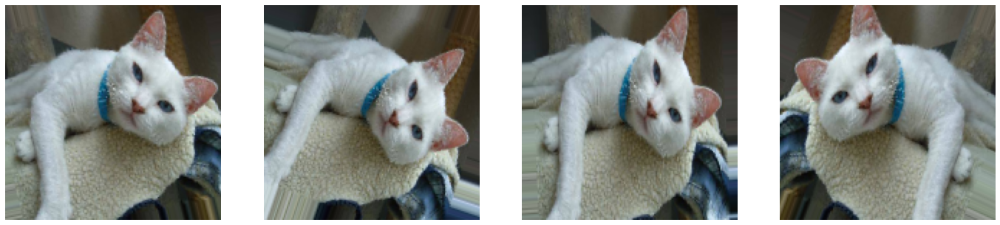

# Transfer learning

In this project, I applied transfer learning to a pre-tranined InceptionResNetV2 model on an image dataset to classify cats vs dogs. 
First, I evaluate the model without training the unfrozen weights. Then, I train the transfer model using binary cross-entropy loss and at the end I chose a sub-network of the original pre-train network and redo the training to compare the results. 

## Overview
 

       
      

