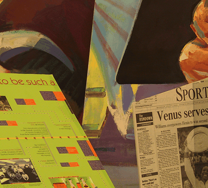

# Video Frame Interpolation

In this project, I am implementing a method to estimate the optical flow between two consecutive frames and generate the middle frame guided by the flow.

The goal is to develop a video frame interpolation tool that can double the rate of a low fps video ; for example from 30 to 60. 

The method is described in this [paper](https://link.springer.com/content/pdf/10.1007/s11263-010-0390-2.pdf)
  

       
 

## Overview
  

       
       
  

  

       
 

The required steps to implement this algorithm are:
- Forward warping flow (from frame0 to frame1) to a position t in the middle of the 2 frames
- Fill any holes in ut using a simple outside-in strategy
- Estimate occlusions masks O0(x) and O1(x), where Oi(x) = 1 means pixel x in image Ii is not visible in the
respective other image.
- Compute the colors of the interpolated pixels by inverse-warping frame 0 and frame 1 to the postion t based on the forwarded-warped flow iflow at t
